# PetriNet Modelling of a Rail Network
The network of interest is given as follows, which consists of 11 sections.

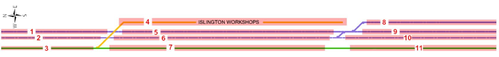

The network can be further divided into the passenger line: 
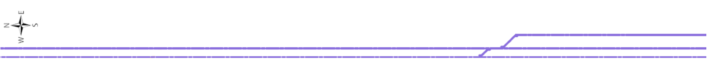
and the freight line connecting to the Islington Workshop:
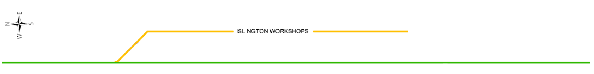
The two lines are disconnected and trains cannot be move from passenger line to freight line and vice versa. 

# Train movements:
Trains can travel N-S (left - right)
- Entry: 1, 3.
- Exit: 4, 8, 9, 11.

Train can travel S-N (right - left)
- Entry: 4, 9, 10, 11
- Exit: 2, 3

Based on the project brief, the following paths are legal: 

North-South: 
- 1, 5, 8
- 1, 5, 9
- 3, 4
- 3, 7, 11

South-North: 
- 4, 3
- 9, 6, 2
- 10, 6, 2
- 11, 7, 3

# Network Segment Descriptions: 
Based on the set of train movements, we can classify different rail sections based on their connectivity characterisitcs. 

## One way section:
One-way section allows trains to move in only one direction - i.e. either North to South or South to North. A place-transition structure of section 2 is shown:  

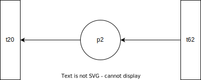

Transitions are named based on the following structure: t<section_from><section_to>. For instance, $t_{62}$ indicates a transition from section 6 to section 2. Transitions that involve section 0 indicate entry/exit. For instance $t_{20}$ indicates the exit transition from section 2. A marking of a place $p_i$ is indicated as $m_i$ and is shown diagramatically as a dot.

## Two-way section:
Two-way section allows trains to move in both directions. A place-transition structure of section 11 is given as follows:

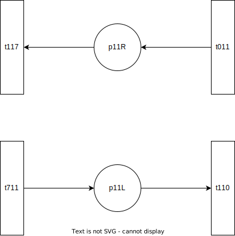

Two-way sections contain two places, corresponding to N-S direction (L) and S-N direction (R). It is noted that some papers uses a simplified version of the above place-transition structure:

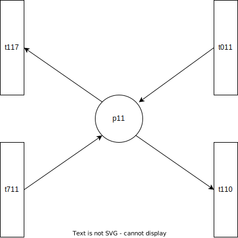

However, I decided to keep the un-simplified version to make explicit that trains that are moving N-S cannot abruptly turn around and move S-N and vice-versa. 

## Junction:
When two paths intersect, a constraint must be placed to prevent multiple trains in the same intersection which can cause accidents to occur. We shall use the point structure as described in ![ref] to control movements of trains in intersection. Consider the intersection between path <1,5> and path <3,4>:

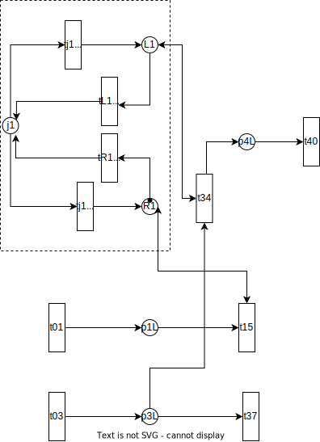

A train passing the junction from section 1 to 5 is represented by the firing of transition $t_{15}$, which requires a marking at $p_{1L}$ (a train is currently present in section 1) and a marking at place $R_1$ of the point system (right path is available for passing). Similarly, passage from section 3 to section 4 requires markings at $p_{3L}$ and $L_1$. Initially, $R_1$ is marked to indicate passenger trains having higher passage priority than freight trains at junction. 

Marking can be changed from $L1$ to $R1$ via the transition $t_{L1j1}$ to place $j_1$ and then firing transition $t_{j1R1}$ to place $R1$, which now enables freight passage. Double direction arrows are used to indicate self-loop -i.e. after $t_15$ is fired, a marking is consumed and produced at $R_1$, leaving the total marking at $R_1$ unchanged.

## Capacity Constraint with Monitor:

Train sections have a capacity constrain of 1 - i.e. there can only be at most one train on any train section at anytime to prevent accidents. This is represented in the place-transition digram with a monitor place ![ref]: 

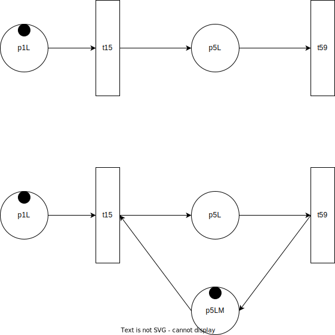

The upper diagram represents section 1 and 5 without any capacity constraint: place $p_{5L}$ can receive markings as long as transition $t_{15}$ is enabled. The second diagram represents the same section, but place 5 can hold at most one marking. The marking of the monitor $p_{5LM}$ can be interpreted a the status of place $p_{5L}$. When $p_{5LM}$ is marked, $p_{5L}$ is ready to receive a marking (train track is empty). When $t_{15}$ is fired, $p_{5LM}$ is no longer marked, prohibiting further marking of $p_{5L}$ until $t_{59}$ is fired - i.e. the track is empty once again.

Similarly, the constrained-place-transition model for sections that allow passage in both directions is shown: 

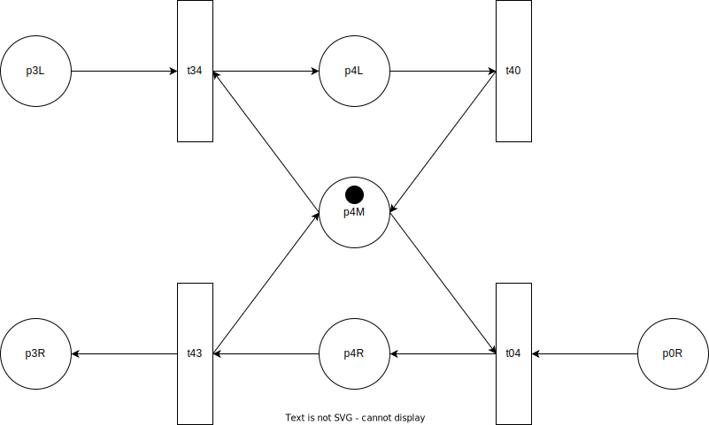

## Entry and Exit: 

Entry from an external source - i.e. train station is represented with place $p_0$ and transition $t_{00}$ which is always enabled. 

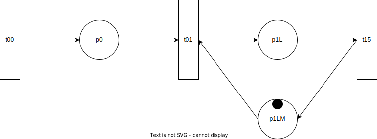

Marking of $p_0$ represents the presence of trains from an external source wishing to enter the network. Whether an external train is allowed to enter is subjected to the availability of the section to be entered. In the figure, place 1 is available should an external train wishes to enter the network. 

Exit is represented as a simple transition t<exit_section><0>.

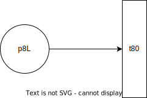

# Full Petrinet

The full model is shown with initial markings indicating that all sections are initially empty.

The two junctions are controlled using point $j_1$ (described previously) and $j_2$. $j_2$ system contains three places $L_2$ that allows passage from section 5 to 8, $R_2$ that allows passage from section 9 to 6, and $M_2$ that allows for passage from 5 to 9 and 10 to 6 at the same time. 

# Limitations

It is assumed that all transitions in the above diagram are both controllable and observable, which corresponds to having a physical semaphore that can stop a train on its track at every transition. This assumption is used to justify that the monitors are admissible. 

Local deadlocks are also possible. For instance, dead-lock would occur if there are a train on section 7 moving South and a train on section 11 moving North at the same time. Such situations are best handled with additional linear constraints on the marking ![ref]. We may stipulate that if there is a train on section 7 moving South then there should not be a train on section 11 moving North at the same time. This could be expressed as a linear constraint
$$m_{7L} + m_{11R} \leq 1 $$